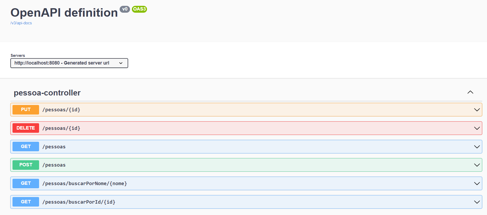
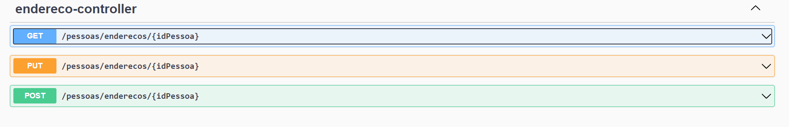

# API de Cadastro de Pessoas

Projeto de uma API REST de cadastro de pessoas com Spring Boot.

### Operações:
- Cadastrar pessoa: `POST: "/pessoas"`
- Listar pessoas: `GET: "/pessoas"`
- Buscar por nome: `GET: "/pessoas/buscarPorNome/{nome}"`
- Buscar por id: `GET: /pessoas/buscarPorId/{id}"`
- Editar pessoa: `PUT: "/pessoas/{id}"`
- Deletar pessoa: `DELETE: "/pessoa/{id}"`
- Listar endereços de uma pessoa: `GET: "/pessoas/enderecos/{idPessoa}"`
- Criar endereços para uma pessoa: `POST: "/pessoas/enderecos/{idPessoa}"`
- Editar endereços de uma pessoa: `PUT: "/pessoas/enderecos/{idPessoa}"`

Realizei integração com a API ViaCEP para que ao salvar ou editar o endereço, sejam automaticamente preenchidos os campos logradouro e localidade (cidade).

Pode ser verificada a documentação da API via Swagger, subindo o projeto: http://localhost:8080/swagger-ui/index.html#/

